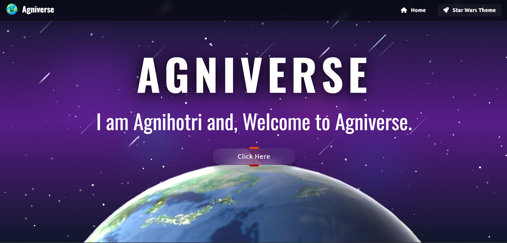
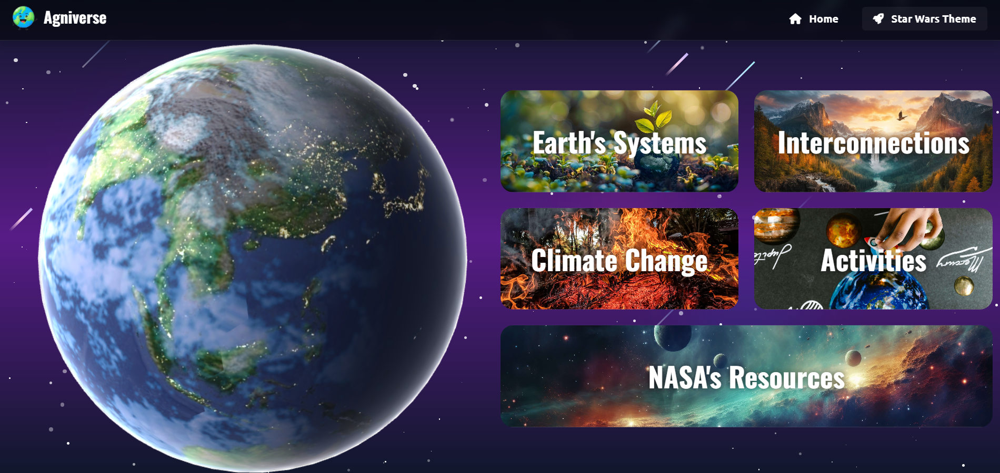

# 🌍 **Agniverse** - Next-Gen Space Education Platform

<div align="center">


**An immersive 3D educational platform that transforms how we learn about Earth's systems and space exploration**

[🌟 **Live Demo**](https://agniverse.netlify.app/) | [📖 **Documentation**](#features) | [🚀 **Getting Started**](#getting-started)

</div>

---

## 📸 Screenshots

Images below are shown in a logical order: **Landing → Contents → Screens**.

1. **Landing section (main page)**  
   

2. **Contents / Overview**  
   

3. **Feature / Page (2025-06-21 05:39:18)**  
   

4. **Feature / Page (2025-06-21 05:40:02)**  
   

5. **Feature / Page (2025-06-21 05:40:37)**  
   

6. **Feature / Page (2025-06-21 05:41:08)**  
   

7. **Feature / Page (2025-06-21 05:41:48)**  
   

---

## 🎯 **What Makes Agniverse Special?**

> **Agniverse** isn't just another educational website—it's a **next-generation interactive experience** that combines cutting-edge 3D technology with space-themed aesthetics to create an unforgettable learning journey through Earth's complex systems.

### 🌟 **Core Highlights**

- 🌍 **Photorealistic 3D Earth** with real-time rotation and dynamic textures
- 🚀 **Star Wars Theme Toggle** with animated space fighters and twinkling stars
- 🔗 **Interactive System Connections** showing how Earth's systems interconnect
- 🎮 **Immersive Learning Modules** covering climate, atmosphere, and natural hazards
- ⚡ **11-Second Cinematic Preloader** for enhanced user experience
- 📱 **Fully Responsive Design** optimized for all devices

---

## 🚀 **Features That Blow Minds**

### 🎨 **Visual Excellence**

- **Three.js Powered 3D Graphics** - Stunning WebGL-rendered Earth with realistic lighting
- **Dynamic Star Wars Background** - Activate space mode with moving fighters and stellar animations
- **Smooth Transitions** - Professional animations and micro-interactions throughout
- **Responsive Design** - Pixel-perfect experience across desktop, tablet, and mobile

### 🧠 **Educational Power**

- **📚 Climate Education Hub** - Comprehensive modules on greenhouse gases and global warming
- **🌪️ Natural Hazards Explorer** - Interactive data on floods, cyclones, and extreme weather
- **🌐 Earth Systems Integration** - Understand atmosphere, hydrosphere, geosphere, biosphere
- **💡 Action-Oriented Solutions** - Real prevention and mitigation strategies

### ⚙️ **Technical Innovation**

- **🔧 Advanced Interconnections System** - Visualize complex Earth system relationships
- **🎛️ Smart Toggle Controls** - Easy-to-use theme switching with visual feedback
- **🛡️ Fallback Systems** - Robust error handling and graceful degradation
- **🎯 Optimized Performance** - Smooth 60fps animations on modern browsers

---

## 🛠️ **Tech Stack**

<div align="center">

| Frontend                                                                                                        | 3D Graphics                                                                                               | Styling                                                                                                      | Tools                                                                                               |
| --------------------------------------------------------------------------------------------------------------- | --------------------------------------------------------------------------------------------------------- | ------------------------------------------------------------------------------------------------------------ | --------------------------------------------------------------------------------------------------- |
|                 |  |                 |           |
|  |           |  |  |

</div>

---

## 🚀 **Getting Started**

### 🔥 **Quick Start** (30 seconds)

```bash
# Clone the repository
git clone https://github.com/DevAgnihotri/Agniverse.git

# Navigate to the project
cd Agniverse

# Open in your browser
# Simply open index.html in any modern browser!
```

### 🎮 **How to Experience Agniverse**

1. **🌍 Explore the 3D Earth** - Watch our planet rotate with realistic textures
2. **🚀 Toggle Star Wars Mode** - Click the "Star Wars Theme" button for space adventure
3. **🔗 Discover Interconnections** - Click on system markers to learn about Earth's connections
4. **📚 Dive into Education** - Explore climate modules and natural hazard information
5. **🎯 Take Action** - Learn about real solutions for environmental challenges

---

## 🎨 **Visual Showcase**

### 🌍 **Earth Systems Mode**

- Photorealistic Earth with dynamic lighting
- Interactive connection points
- Educational overlays and information panels

### 🚀 **Star Wars Theme Mode**

- Deep space background with twinkling stars
- Animated space fighters using Font Awesome icons
- Golden UI elements with space aesthetics
- Smooth transitions between modes

---

## 📊 **Project Stats**

<div align="center">


</div>

---

## 🎯 **Browser Support**

| Browser                                                                                                        | Status                 | Notes                            |
| -------------------------------------------------------------------------------------------------------------- | ---------------------- | -------------------------------- |
|      | ✅ **Fully Supported** | Recommended for best performance |
|  | ✅ **Fully Supported** | Excellent WebGL performance      |
|             | ✅ **Fully Supported** | Great on macOS and iOS           |
|         | ✅ **Fully Supported** | Modern Chromium-based            |

**Requirements:** Modern browser with WebGL support, JavaScript enabled

---

## 👨‍💻 **Created By**

<div align="center">

### **Dev Agnihotri**

**Full Stack AI Developer** | **Space Tech Enthusiast** | **Climate Education Advocate**

[](https://github.com/DevAgnihotri)
[](https://linkedin.com/in/dev-agnihotri)

_"Building the future of education through immersive technology and AI-powered experiences"_

</div>

---

## 🌟 **Why Agniverse?**

> In a world where climate education needs innovation, **Agniverse** bridges the gap between complex Earth science and engaging user experience. By combining **cutting-edge 3D graphics**, **interactive learning**, and **space-themed aesthetics**, we've created more than just an educational platform—we've built an **experience that inspires**.

### 🎯 **Our Mission**

- **Democratize Earth Science Education** through accessible technology
- **Inspire Action** on climate change through immersive learning
- **Bridge the Gap** between scientific complexity and public understanding
- **Pioneer** the future of interactive educational platforms

---

## 💡 **Inspiration**

Climate change education is often dry, complex, and disconnected from reality. We envisioned a platform where learning about Earth's systems feels like exploring space—immersive, engaging, and unforgettable. By combining cutting-edge 3D technology with Star Wars aesthetics, we created an educational experience that makes complex science accessible and exciting.

## 🎯 **What it does**

Agniverse transforms Earth science education through:
- **Interactive 3D Earth visualization** with real-time rotation and dynamic textures
- **Star Wars-themed space exploration mode** with animated fighters and stellar backgrounds
- **Interconnected systems learning** showing how atmosphere, hydrosphere, and climate interact
- **Immersive educational modules** covering natural hazards, climate change, and prevention strategies
- **Seamless theme switching** between educational and space exploration modes

## 🛠️ **How we built it**

**Frontend Magic:**
- **Three.js & WebGL** for photorealistic 3D Earth rendering
- **Vanilla JavaScript** for smooth animations and interactions
- **Custom CSS animations** for Star Wars theme and space effects
- **Responsive design** ensuring perfect experience across all devices

**Technical Innovation:**
- Implemented dual-mode system (Educational + Star Wars theme)
- Created dynamic interconnection visualization system
- Built custom preloader with 11-second cinematic experience
- Developed fallback modal system for enhanced user experience

## 🚧 **Challenges we ran into**

- **WebGL Performance Optimization** - Balancing visual quality with smooth frame rates
- **Complex Animation Synchronization** - Coordinating star movements, fighter animations, and theme transitions
- **Cross-browser Compatibility** - Ensuring consistent Three.js rendering across different browsers
- **State Management** - Managing dual themes and interactive elements without conflicts
- **Mobile Responsiveness** - Adapting 3D experiences for touch interfaces and varying screen sizes

## 🏆 **Accomplishments that we're proud of**

- **Seamless 3D Integration** - Achieved console-quality 3D graphics in a web browser
- **Dual-Theme Innovation** - Built the first educational platform with Star Wars space mode
- **Performance Excellence** - Maintained 60fps animations across all features
- **User Experience Design** - Created intuitive interactions that feel natural and engaging
- **Educational Impact** - Made complex Earth science concepts accessible through visual storytelling

## 📚 **What we learned**

- **Advanced Three.js Techniques** - Mastered 3D graphics, lighting, and texture management
- **Performance Optimization** - Learned to balance visual fidelity with browser performance
- **User Experience Design** - Discovered how theme consistency enhances learning engagement
- **Educational Technology** - Understood the power of immersive experiences in knowledge retention
- **Full-Stack Integration** - Gained expertise in seamlessly blending frontend magic with educational content

## 🚀 **What's next for Agniverse**

**Immediate Roadmap:**
- **VR/AR Integration** - Expand to virtual and augmented reality platforms
- **AI-Powered Personalization** - Adaptive learning paths based on user interests
- **Real-time Data Integration** - Live satellite feeds and climate monitoring
- **Collaborative Features** - Multi-user exploration and shared learning experiences

**Long-term Vision:**
- **Global Education Partnership** - Integration with schools and universities worldwide
- **Extended Universe** - Mars exploration, solar system tours, and deep space education
- **API Development** - Allow educators to create custom learning modules
- **Mobile App** - Native iOS/Android applications with offline capabilities

---

## 📄 **License**

<div align="center">

**© 2025 Agniverse. All rights reserved.**

_Making Earth science education accessible through innovative technology_

[](LICENSE)

</div>

---

<div align="center">

### 🚀 **Ready to Explore?**

**[🌍 Launch Agniverse](https://agniverse.netlify.app/)**

_The universe of Earth science education awaits you_

---

**⭐ Star this repo if you found it awesome!** | **🍴 Fork it to build something amazing** | **📢 Share with fellow space enthusiasts**

</div>
